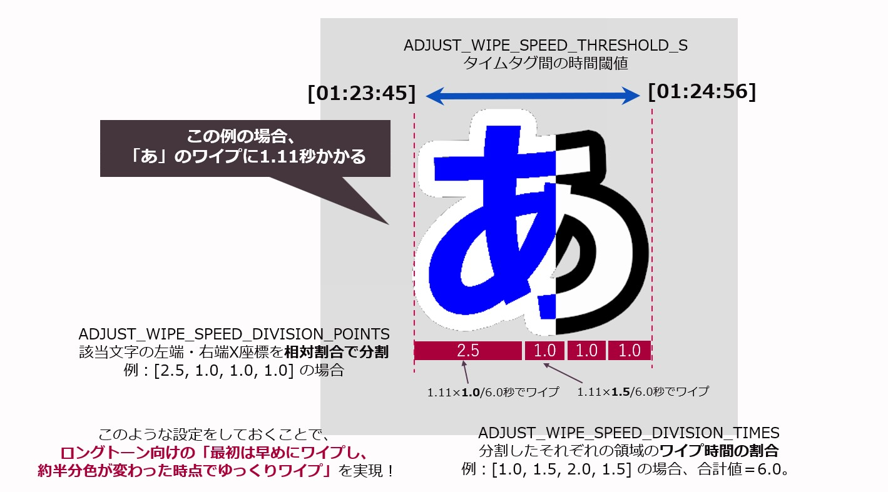

<div align="center">
  
  <p style="font-weight: bold;">MID2BAR-Player</p>
</div>

<div align="center">

[](https://www.python.org/)
[](https://github.com/psf/black)
[](https://github.com/keisuke-okb/mid2bar-player/releases)
[](https://github.com/keisuke-okb/mid2bar-player/releases)
[](README.md)
[](./README_ja.md)

</div>

# MID2BAR-Player

従来の「MID2BAR」「LRC2EXO」を統合し、**拡張ルビ規格のLRC歌詞ファイル、マーカー付きのMIDIファイル、音源を用意するだけでカラオケ字幕動画を簡単に作成できるソフトウェア**です。マイク入力を用いた簡易的な採点機能も搭載しています。

できるだけ汎用的な規格のファイルのままカラオケ字幕動画を作成することを目標にしています。

- 注意：本リポジトリのプログラム（改変含む）またはビルド済みパッケージを利用して作成した動画を動画投稿サイトにアップロードすることが可能です。その際は、使用したソフトウェアとして「**MID2BAR-Player**」と表記をお願いいたします。また、作成した動画のアップロードによって生じた問題についてはいかなる責任を負いかねますのでご注意ください。

## 概要

- **MID2BAR-Player**: MIDIのメロディ情報とLRC（ルビ対応）歌詞、任意の背景動画／音声を組み合わせてカラオケ表示・可視化するスタンドアロンプレイヤーです。
- **主な機能**: 譜割り（区切り）を作成したメロディーMIDIファイルと歌詞と同期表示、表示エフェクト（ノートバー、グロー、パーティクル）、マイク入力によるリアルタイム採点（実際のカラオケ機器のものとは異なり、音程の一致度のみを算出しています。参考程度とお考え下さい。）、映像の重ね合わせ、録画（エクスポート）機能。


### 動作環境

- OS: Windows / masOS* / Linux*
  - 音程バーのページ切り替えアニメーション時に画面がチカチカする場合、`app_settings/settings.json`>`FADE_TIME`を`0.0`に設定してください。
- 外部ソフトウェア：ffmpeg (画面の録画機能を使用する場合。ffmpeg.exe, ffprove.exeがあるフォルダを環境変数に登録するか、当アプリケーションのあるフォルダ直下に配置してください。)


## サンプルプロジェクトを使ったチュートリアル（Windows向けビルド済みパッケージの例）

1. `MID2BAR-Player.exe` を起動します。
2. 「ファイル＞プロジェクトを開く」メニューから、「sample/sample_project.json」を読み込むと以下の設定がサンプルの音楽に設定されます。
	- 音声ファイル（例: WAV / MP3など）
	- MIDIファイル（.mid）
	- 歌詞ファイル（LRC, 拡張ルビ形式）
	- 背景動画（任意）
3. 画面下の「設定を適用して再生」を押すと、カラオケ字幕動画の再生の準備が始まります。読み込みが完了すると、歌詞のプレビュー生成など初期処理が行われます（生成中はメッセージが表示されます）。
4. 準備が完了した後、スペースキーを押して再生を開始します。


## 使い方（ソースコード）

1. 仮想環境などでMID2BAR-Player向けの環境を作成してください。

```powershell
PS> git clone https://github.com/keisuke-okb/mid2bar-player
PS> cd mid2bar-player
PS> python -m venv venv
PS> .\venv\Scripts\Activate.ps1
```


```powershell
(venv) PS> pip install -r requirements.txt
```

2. `python main_gui.py`を実行するとビルド済みパッケージと同様に設定を行い、プレイヤーを起動できます。
3. `main.py`を参考として、ほかのPythonプログラムからMID2BAR-Playerを呼び出すことも可能です。


## 手元のデータを使ってカラオケ動画を作成する手順

### 1. ルビ付きのLRC歌詞ファイルを作成

サンプルの歌詞ファイルをもとに、「RhythmicaLyrics」などを用いて拡張ルビ規格のLRCファイルを作成してください。
**「①」「②」などをタイムタグで挟むと、パート分けとして認識します。**
パート分け時のアイコンや色の設定は**歌詞字幕用の設定ファイル**（デフォルトは「lyrics_settings/settings_default.json」）で変更することが可能です。

- `sample/【音楽：魔王魂】シャイニングスター（ショート）.lrc`：通常の歌詞ファイル
- `【音楽：魔王魂】シャイニングスター（ショート）_パート字幕.lrc`：パート分け字幕（実際の曲とは異なり、記法の参照用です）

当ソフトウェアは、空白行を歌詞ブロックの区切りとして認識します。例えば、最初の２行は一つのブロックになります：
```
[00:09:65]た[00:09:83]だ[00:10:39]風[00:10:39]([00:10:39]かぜ[00:11:17])[00:11:17]に[00:11:37]揺[00:11:37]([00:11:37]ゆ[00:11:54])[00:11:54]ら[00:11:71]れ[00:11:90]て[00:12:48]
[00:12:66]何[00:12:66]([00:12:66]なに[00:13:02])[00:13:02]も[00:13:19]考[00:13:19]([00:13:19]かんが[00:14:19])[00:14:19]え[00:14:57]ず[00:14:75]に[00:15:48]
```

途中空白を挟まず３行連続している箇所は、３行をまとめて一つのブロックとして認識します。

```
[00:35:29]シャ[00:35:45]イ[00:35:61]ニ[00:35:76]ン[00:35:94]グ[00:36:09]ス[00:36:24]ター[00:36:58]綴[00:36:58]([00:36:58]つづ[00:37:30])[00:37:30]れ[00:37:49]ば[00:37:94]
[00:38:10]夢[00:38:10]([00:38:10]ゆめ[00:38:46])[00:38:46]に[00:38:66]眠[00:38:66]([00:38:66]ねむ[00:39:22])[00:39:22]る[00:39:64]幻[00:39:64]([00:39:64]まぼろし[00:40:77])[00:40:77]が[00:41:00][00:41:38]掌[00:41:38]([00:41:38]てのひら[00:42:29])[00:42:29]に[00:42:67]降[00:42:67]([00:42:67]ふ[00:43:04])[00:43:04]り[00:43:41]注[00:43:41]([00:43:41]そそ[00:43:96])[00:43:96]ぐ[00:44:44]
[00:44:56]新[00:44:56]([00:44:56]あら[00:44:91])[00:44:91]た[00:45:29]な[00:45:66]世[00:45:66]([00:45:66]せ[00:46:07])[00:46:07]界[00:46:07]([00:46:07]かい[00:46:63])[00:46:63]へ[00:47:19]
```

### 2. メロディーMIDIデータの音程バー表示区切りを作成

- **このソフトウェアは、MIDIファイルの「マーカー」が挿入されている場所をページ区切りとして認識します。**
- 各種MIDI編集ソフトウェアでマーカーを挿入するか、パッケージ同梱の`MIDI Marker Editor.exe`を使用してください。


1. `MIDI Marker Editor.exe`を実行し、メニュー「File＞Open MIDI...」を押して表示させたいメロディラインのMIDIデータを読み込みます。**誤動作を避けるため、主旋律のMIDIチャンネルは0に設定してください。**
2. 同期した音源データを「File＞Set reference audio...」メニューから選択し、再生ボタンを押すと音源が再生され、現在位置が動くことを確認します。
3. 音程バーを表示する両端の区切りを挿入したい箇所でダブルクリックすると、マーカーが挿入されます。
4. 「File＞Save MIDI with markers...」メニューを押して、マーカーが挿入されたメロディーラインのMIDIファイルを保存します。
5. `MID2BAR-Player`本体で書き出したMIDIファイルを指定します。


### 3. （オプション）各種画像データ、設定ファイルの準備

その他、プレイヤーに表示する画像や詳細な設定を変更できます。

- スプラッシュ画像：再生冒頭、プレイヤー全体に表示する画像
- タイトルロゴ画像：再生冒頭、プレイヤーの中心に表示する画像（曲名を想定）
- 音源：MP3など、プレイヤーで再生する音楽ファイル
- カラオケ字幕生成の設定：字幕生成の詳細設定（デフォルトは`lyrics_settings/settings_default.json`）
- プレイヤー全般設定：MID2BAR-Playerの表示にかかわる全般の設定（デフォルトは`app_settings/settings.json`）
- 画像素材設定：MID2BAR-Playerで使用する画像素材の設定（デフォルトは`app_settings/assets.json`）


## 基本操作（キーボード・マウス）

- **Space**: 再生 / 一時停止
- **R**: 再スタート（先頭から再生）
- **A**: 小節の自動再生（Bar Auto Play）ON/OFF
- **M**: マイク入力（リアルタイム採点）ON/OFF
- **F11**: フルスクリーン切替
- **↑ / ↓**: 音量調整
- **ESC**: 終了
- **マウス左クリック**: メニューの表示、再生位置をシーク（シークバー上）


## 録画（動画出力）

- `ffmpeg`を利用して、プレイヤーの映像をMP4動画として書き出すことができます。
- 録画を有効にして起動すると、再生中の映像と音声を合成して動画出力できます。
- 録画中は、画面を操作しないでください。


## トラブルシューティング

- 音が出ない場合: システムの音量、Pygameが使用するオーディオデバイス、ファイル形式を確認してください。
- マイクが反応しない場合: マイクがシステムで有効か、アプリにマイク許可があるかを確認してください。


## マイク入力とリアルタイム採点（参考程度の機能）

- 設定でマイク入力をONにして起動するか、再生中に `M` でマイク入力を有効にすると、FFTベースのピッチ検出により歌声を解析してノートとの一致度やピッチ精度をページ単位で算出します。
- 画面をクリックしてメニューを表示すると、リアルタイムで点数を確認できます。
- マイク入力の閾値や遅延補正などのパラメータは設定ファイル（`app_settings/settings.json`）で調整できます。


## ライセンス

- リポジトリに含まれる各種ファイルのうち、別途ファイル名にライセンスが明記されていないファイルはすべてリポジトリの `LICENSE` に基づきます。
- `sample/`に含まれるサンプル音楽の著作権は[森田交一（魔王魂）](https://maou.audio/)に帰属します。
- 本リポジトリのプログラム（改変含む）またはビルド済みパッケージを利用して作成した動画を動画投稿サイトにアップロードすることが可能です。その際は、使用したソフトウェアとして「MID2BAR-Player」と表記をお願いいたします。また、作成した動画のアップロードによって生じた問題についてはいかなる責任を負いかねますのでご注意ください。


# 設定一覧

## プレイヤー全般設定：app_settings/settings.json

#### 画面・ウィンドウ設定

| 項目 | デフォルト値 | 説明 |
|------|-------------|------|
| `SCREEN_WIDTH` | 1920 | 描画領域の幅（ピクセル） |
| `SCREEN_HEIGHT` | 1080 | 描画領域の高さ（ピクセル） |
| `WINDOW_WIDTH` | 1920 | ウィンドウの初期幅（ピクセル） |
| `WINDOW_HEIGHT` | 1080 | ウィンドウの初期高さ（ピクセル） |
| `FULL_SCREEN` | false | フルスクリーンモードで起動するか |
| `SCREEN_FPS` | 60 | フレームレート（FPS） |
| `MENU_H` | 300 | メニューバーの高さ（ピクセル） |
| `WINDOW_BACKGROUND_COLOR` | [10, 10, 10] | ウィンドウ背景色（RGB） |

#### UI・フォント設定

| 項目 | デフォルト値 | 説明 |
|------|-------------|------|
| `UI_LANG` | "ja" | UIの表示言語（"ja": 日本語、"en": 英語） |
| `UI_FONT` | "./fonts/NotoSansJP-Medium.ttf" | UIに使用するフォントファイルのパス |
| `BAR_COUNT_FONT` | "./fonts/NotoSansJP-Black.ttf" | バーカウント表示用フォントファイルのパス |
| `BAR_COUNT_FONT_SIZE` | 30 | バーカウントのフォントサイズ |

#### 再生設定

| 項目 | デフォルト値 | 説明 |
|------|-------------|------|
| `PLAYBACK_TIME_SCALE` | 1.001 | 再生速度の補正値（1.0が通常速度。録画時は無視されます。時間が進むにつれ、音楽と字幕・音程バーがずれる場合の補正に使用します。） |
| `DEFAULT_VOLUME` | 80 | 初期音量（0〜100） |
| `DISPLAY_TITLE_DURATION` | 2.0 | タイトル画面の表示時間（秒） |

#### 色設定

| 項目 | デフォルト値 | 説明 |
|------|-------------|------|
| `BG_COLOR` | [20, 20, 40] | 背景色（RGB） |
| `VIDEO_ALPHA` | 210 | 背景動画の不透明度（0〜255） |
| `LINE_COLOR` | [100, 100, 100, 200] | ガイドラインの色（RGBA） |
| `NOTE_COLOR` | [100, 100, 100] | 音符の色（RGB） |
| `CURRENT_POS_COLOR` | [255, 50, 50] | 現在位置インジケーターの色（RGB） |
| `PASSED_NOTE_COLOR` | [255, 200, 100] | 通過済み音符の色（RGB） |
| `TEXT_COLOR` | [255, 255, 255] | テキストの色（RGB） |

#### スプラッシュ画面設定

| 項目 | デフォルト値 | 説明 |
|------|-------------|------|
| `SPLASH_TEXT_X_OFFSET` | -50 | スプラッシュテキストのX軸オフセット |
| `SPLASH_TEXT_Y_OFFSET` | -50 | スプラッシュテキストのY軸オフセット |
| `SPLASH_TEXT_LINE_HEIGHT` | 80 | スプラッシュテキストの行間隔 |

#### バー表示エリア設定

| 項目 | デフォルト値 | 説明 |
|------|-------------|------|
| `BAR_AREA_TOP` | 50 | バー表示エリアの上端位置（ピクセル） |
| `BAR_AREA_HEIGHT` | 250 | バー表示エリアの高さ（ピクセル） |
| `BAR_AREA_LEFT` | 100 | バー表示エリアの左端位置（ピクセル） |
| `BAR_AREA_WIDTH` | 1720 | バー表示エリアの幅（ピクセル） |
| `DISPLAY_PITCH_RANGE_MIN` | 23 | 表示する最小音域範囲（半音数） |

#### 現在位置バー（Now Bar）設定

| 項目 | デフォルト値 | 説明 |
|------|-------------|------|
| `NOW_BAR_TOP` | 34 | 現在位置バーの上端位置（ピクセル） |
| `NOW_BAR_WIDTH` | 200 | 現在位置バーの幅（ピクセル） |
| `NOW_BAR_HEIGHT` | 286 | 現在位置バーの高さ（ピクセル） |
| `HIDE_NOW_BAR_WHEN_NO_NOTES` | true | 音符がないときに現在位置バーを非表示にするか |

#### バー自動演奏設定

| 項目 | デフォルト値 | 説明 |
|------|-------------|------|
| `BAR_AUTO_PLAY` | true | バー自動演奏モードを有効にするか |
| `BAR_AUTO_PLAY_CHANNELS` | [0, 1, 2] | 自動演奏対象のMIDIチャンネル |
| `BAR_PASSED_ROUGHNESS` | 10 | バーの塗りつぶし時の粗さ（滑らかさ） |

#### エフェクト・アニメーション設定

| 項目 | デフォルト値 | 説明 |
|------|-------------|------|
| `BAR_PASSED_PARTICLE_RAND` | 0.7 | パーティクル発生確率（0.0〜1.0） |
| `BAR_PASSED_COUNT_ANIMATION_TIME` | 0.8 | カウントアニメーションの時間（秒） |
| `BAR_PASSED_COUNT_ANIMATION_CURVE_STRENGTH` | -0.1 | カウントアニメーションの曲線の強さ |
| `BAR_PASSED_COUNT_ANIMATION_ACCEL` | 3.0 | カウントアニメーションの加速度 |
| `BAR_PASSED_COUNT_ICON_SIZE` | 40 | カウントアイコンのサイズ（ピクセル） |
| `BAR_PASSED_COUNT_ICON_MARGIN` | 10 | カウントアイコンの余白（ピクセル） |
| `BAR_GLOW_DURATION` | 0.3 | バー発光エフェクトの持続時間（秒） |
| `BAR_GLOW_SCALE` | 3.0 | バー発光時の拡大率 |

#### カウント表示設定

| 項目 | デフォルト値 | 説明 |
|------|-------------|------|
| `BAR_PASSED_COUNT_ANIMATION_DICT` | {...} | 各音符タイプのアニメーション設定（位置と色） |
| `BAR_COUNT_DICT` | {...} | 各音符タイプのカウント表示設定（位置と色） |

#### BAR_PASSED_COUNT_ANIMATION_DICT / BAR_COUNT_DICT の音符タイプ

- `normal`: 通常の音符
- `max`: 最高音の音符
- `min`: 最低音の音符
- `up`: 急上昇する音符
- `down`: 急降下する音符
- `long`: 長い音符

#### 音域ゲージ設定

| 項目 | デフォルト値 | 説明 |
|------|-------------|------|
| `RANGE_GAUGE_POS` | [1480, 354] | 音域ゲージの表示位置 [x, y] |
| `RANGE_GAUGE_W` | 390 | 音域ゲージの幅（ピクセル） |
| `RANGE_GAUGE_H` | 23 | 音域ゲージの高さ（ピクセル） |

#### タイミング設定

| 項目 | デフォルト値 | 説明 |
|------|-------------|------|
| `PREVIEW_TIME` | 2.0 | バーのプレビュー時間（秒） |
| `REMAIN_TIME` | 3.0 | バーの残留時間（秒） |
| `FADE_TIME` | 0.5 | フェードイン/アウト時間（秒） |
| `LAG_TIME` | 0.3 | 表示遅延時間（秒） |

#### シークバー設定

| 項目 | デフォルト値 | 説明 |
|------|-------------|------|
| `SEEKBAR_TOP` | 850 | シークバーの上端位置（ピクセル） |
| `SEEKBAR_LEFT` | 100 | シークバーの左端位置（ピクセル） |
| `SEEKBAR_WIDTH` | 1720 | シークバーの幅（ピクセル） |
| `SEEKBAR_HEIGHT` | 10 | シークバーの高さ（ピクセル） |

#### スコアリング設定

| 項目 | デフォルト値 | 説明 |
|------|-------------|------|
| `PITCH_MATCH_SCORE_RATIO` | 0.3 | ピッチ一致度のスコア比重 |
| `PITCH_ACCURACY_SCORE_RATIO` | 0.7 | ピッチ精度のスコア比重 |

#### マイク入力設定

| 項目 | デフォルト値 | 説明 |
|------|-------------|------|
| `RMS_THRESHOLD` | 0.02 | マイク入力の音量閾値（RMS） |
| `MIC_INPUT_DURATION` | 0.0 | マイク入力の持続時間（秒） |
| `MIC_INPUT_DELAY` | 0.17 | マイク入力の遅延補正（秒） |
| `MIC_INPUT_OFFSET` | 0.2 | マイク入力のオフセット（秒） |
| `MIC_INPUT_PITCH_TOLERANCE` | 0.8 | ピッチ許容範囲（半音） |
| `MIC_INPUT_NOTE_CONNECT_DURATION` | 0.1 | 音符接続の最大時間間隔（秒） |
| `MIC_INPUT_MARGIN` | 0.01 | マイク入力のマージン時間（秒） |

#### オーディオ設定

| 項目 | デフォルト値 | 説明 |
|------|-------------|------|
| `DEFAULT_SAMPLE_RATE` | 44100 | デフォルトのサンプリングレート（Hz） **使用するマイクデバイスのサンプルレートを確認してください** |
| `DEFAULT_BLOCK_SIZE` | 4096 | オーディオブロックサイズ（サンプル数） |
| `DEFAULT_CHANNELS` | 1 | デフォルトのチャンネル数（1: モノラル、2: ステレオ） |
| `NOTE_NAMES` | ["C", "C#", ...] | 音名の配列 |

#### 画面録画・エンコーディング設定

| 項目 | デフォルト値 | 説明 |
|------|-------------|------|
| `AUDIO_CODEC` | "aac" | オーディオコーデック |
| `AUDIO_BPS` | "320k" | オーディオビットレート |
| `VIDEO_CODEC` | "libx264" | ビデオコーデック（GPUエンコードを使う場合、`h264_nvenc`などに変更可能） |
| `VIDEO_BPS` | "10M" | ビデオビットレート |

#### 注意事項

- 座標や寸法の値は、`SCREEN_WIDTH`と`SCREEN_HEIGHT`を基準とした相対的な位置です
- 色の値は`[R, G, B]`または`[R, G, B, A]`形式で、0〜255の範囲で指定します
- タイミング設定は秒単位で指定します
- マイク入力設定は、環境やマイクの性能に応じて調整が必要な場合があります


## 画像素材：app_settings/assets.json

### 概要

`assets.json`は、MID2BAR-Playerで使用する画像素材のパスを定義する設定ファイルです。

### 基本UI画像

| 項目 | パス例 | 説明 |
|------|--------|------|
| `project_front` | "images/ui/project_front.png" | プロジェクト前面のUI画像（前景レイヤー） |
| `project_back` | "images/ui/project_back.png" | プロジェクト背景のUI画像（背景レイヤー） |
| `now_bar` | "images/ui/now_bar.png" | 現在位置を示すバーの画像 |
| `range_gauge` | "images/ui/range_gauge.png" | 音域ゲージの画像 |

## アイコン画像

`icons`オブジェクトには、音符の特徴を示すアイコン画像を定義します。

| 項目 | パス例 | 説明 |
|------|--------|------|
| `icons.up` | "images/pitch/up.png" | 急上昇音符のアイコン |
| `icons.down` | "images/pitch/down.png" | 急降下音符のアイコン |
| `icons.long` | "images/pitch/long.png" | 長音符のアイコン |

## バー画像（bars）

`bars`オブジェクトは、MIDIチャンネルごとに音符バーの画像を定義します。各チャンネルは、複数の音符タイプとパーツに分かれています。

### 構造

```
bars
├── "0" (チャンネル0)
│   ├── normal (通常の音符)
│   ├── max (最高音の音符)
│   ├── min (最低音の音符)
│   ├── match (マイク入力：部分一致)
│   ├── match_all (マイク入力：完全一致)
│   └── unmatch (マイク入力：不一致)
├── "1" (チャンネル1)
│   └── ...
└── "2" (チャンネル2)
    └── ...
```

### 音符タイプ

| タイプ | 説明 | 使用場面 |
|--------|------|----------|
| `normal` | 通常の音符 | 最高音・最低音以外の音符 |
| `max` | 最高音の音符 | 楽曲内で最も高い音程の音符 |
| `min` | 最低音の音符 | 楽曲内で最も低い音程の音符 |
| `match` | 部分一致 | マイク入力モード時、音程は一致しているが完全には歌えていない |
| `match_all` | 完全一致 | マイク入力モード時、音程・タイミングともに完璧に一致 |
| `unmatch` | 不一致 | マイク入力モード時、音程が一致していない |

### バーパーツ

各音符タイプには、以下の画像パーツが必要です。バーは3分割（左・中央・右）の伸縮可能な構造になっています。

#### 背景パーツ（back）

| パーツ | パス例 | 説明 |
|--------|--------|------|
| `back_left` | "images/bar/1_winered/back_left.png" | バー背景の左端部分 |
| `back_mid` | "images/bar/1_winered/back_mid.png" | バー背景の中央部分（伸縮） |
| `back_right` | "images/bar/1_winered/back_right.png" | バー背景の右端部分 |

#### 塗りつぶしパーツ（fill）

| パーツ | パス例 | 説明 |
|--------|--------|------|
| `fill_left` | "images/bar/1_winered/fill_left.png" | 演奏進行中の塗りつぶし左端 |
| `fill_mid` | "images/bar/1_winered/fill_mid.png" | 演奏進行中の塗りつぶし中央（伸縮） |
| `fill_right` | "images/bar/1_winered/fill_right.png" | 演奏進行中の塗りつぶし右端 |

#### 通過済みパーツ（passed）

| パーツ | パス例 | 説明 |
|--------|--------|------|
| `passed_left` | "images/bar/1_winered/passed_left.png" | 演奏完了後のバー左端 |
| `passed_mid` | "images/bar/1_winered/passed_mid.png" | 演奏完了後のバー中央（伸縮） |
| `passed_right` | "images/bar/1_winered/passed_right.png" | 演奏完了後のバー右端 |

#### エフェクトパーツ

| パーツ | パス例 | 説明 |
|--------|--------|------|
| `glow` | "images/bar/1_winered/glow.png" | バー通過時の発光エフェクト画像 |

## カスタマイズ例

### 新しいチャンネルの追加

複数のパートを持つ楽曲の場合、チャンネルごとに異なる色やデザインのバーを設定できます。

```json
{
  "bars": {
    "0": {
      "normal": { /* ワインレッドのバー */ }
    },
    "1": {
      "normal": { /* ブルーのバー */ }
    },
    "2": {
      "normal": { /* グリーンのバー */ }
    }
  }
}
```

### マイク入力用のバーデザイン例

`match`、`match_all`、`unmatch`タイプは、マイク入力モードで使用されます。

- **match_all**: 完璧に歌えた時 → 鮮やかなグラデーション
- **match**: ほぼ正確だが完璧ではない時 → 単色
- **unmatch**: 音程が外れた時 → 警告色（赤など）

### 画像仕様

#### 推奨サイズ

- **バーパーツ**: 高さは統一、幅は左右端が固定、中央部分は1px幅でも可（伸縮される）
- **now_bar**: `settings.json`の`NOW_BAR_WIDTH`×`NOW_BAR_HEIGHT`に合わせる
- **アイコン**: `settings.json`の`BAR_PASSED_COUNT_ICON_SIZE`の正方形

#### ファイル形式

- PNG形式を推奨（透過対応）
- 背景が透明なアルファチャンネル付き画像を使用すると、重ね合わせ表示が美しくなります

### 注意事項

- すべてのチャンネル・タイプ・パーツについて画像ファイルを用意する必要があります
- パスは相対パスで指定し、プロジェクトルートからの位置を記述します
- 画像が見つからない場合、アプリケーション起動時にエラーが発生します
- バーの左右端パーツの幅は`settings.json`の内部計算で自動調整されます


## カラオケ字幕生成の設定：lyrics_settings/settings_default.json

- 字幕全般の設定

| 変数名                                     | 型                                                     | 説明                                                 |
|--------------------------------------------|--------------------------------------------------------|------------------------------------------------------|
| `GENERAL.WIDTH`                            | int                                                    | 字幕１行分の画像幅                                   |
| `GENERAL.HEIGHT`                           | int                                                    | 字幕１行分の画像高さ                                 |
| `GENERAL.X_BASE_INIT`                      | int                                                    | 1文字目のデフォルトX座標（字幕１行分の画像の左上が原点） |
| `GENERAL.Y_LYRIC`                          | int                                                    | 歌詞のY座標（字幕１行分の画像の左上が原点）           |
| `GENERAL.Y_RUBY`                           | int                                                    | ルビのY座標（字幕１行分の画像の左上が原点）           |
| `GENERAL.COLOR_FILL_BEFORE`                | int[R(0-255), G(0-255), B(0-255), A(0-255)]            | ワイプ前の文字色                                     |
| `GENERAL.COLOR_STROKE_FILL_BEFORE`         | int[R(0-255), G(0-255), B(0-255), A(0-255)]            | ワイプ前の縁色                                       |
| `GENERAL.COLOR_FILL_AFTER`                 | int[R(0-255), G(0-255), B(0-255), A(0-255)]            | ワイプ後の文字色                                     |
| `GENERAL.COLOR_STROKE_FILL_AFTER`          | int[R(0-255), G(0-255), B(0-255), A(0-255)]            | ワイプ後の縁色                                       |
| `GENERAL.COLOR_FILL_BEFORE_CHORUS`         | int[R(0-255), G(0-255), B(0-255), A(0-255)]            | ワイプ前の文字色（合いの手、コーラス用）               |
| `GENERAL.COLOR_STROKE_FILL_BEFORE_CHORUS`  | int[R(0-255), G(0-255), B(0-255), A(0-255)]            | ワイプ前の縁色（合いの手、コーラス用）                 |
| `GENERAL.COLOR_FILL_AFTER_CHORUS`          | int[R(0-255), G(0-255), B(0-255), A(0-255)]            | ワイプ後の文字色（合いの手、コーラス用）               |
| `GENERAL.COLOR_STROKE_FILL_AFTER_CHORUS`   | int[R(0-255), G(0-255), B(0-255), A(0-255)]            | ワイプ後の縁色（合いの手、コーラス用）                 |
| `GENERAL.DISABLE_STROKE_ANTIALIASING`      | bool                                                   | 字幕の縁のアンチエイリアシングを無効にする（字幕を重ねた時の縁の透け対策）|


- 合いの手、パート分けモード用字幕設定

| 変数名                                     | 型                                                    | 説明                                                 |
|--------------------------------------------|-------------------------------------------------------|------------------------------------------------------|
| `GENERAL.CHANGE_TO_CHORUS_STR`             | str[]                                                 | 合いの手、コーラスモードに移行する対象文字リスト     |
| `GENERAL.CHANGE_TO_MAIN_STR`               | str[]                                                 | 合いの手、コーラスに移行する対象文字リスト           |
| `GENERAL.CHANGE_TO_PART_STR`               | str[]                                                 | パート分けモードに移行する対象文字リスト             |
| `GENERAL.PART_ICON`                        | str[]                                                 | パート分け表示のアイコン画像のパスリスト             |
| `GENERAL.PART_ICON_HEIGHT`                 | int                                                   | パート分けアイコン画像の高さ                         |
| `GENERAL.PART_ICON_OFFSET_X`               | int                                                   | パート分けアイコン画像のX座標オフセット              |
| `GENERAL.PART_ICON_OFFSET_Y`               | int                                                   | パート分けアイコン画像のY座標オフセット              |
| `GENERAL.PART_ICON_MARGIN_X`               | int                                                   | パート分けアイコン画像のX方向余白                    |
| `GENERAL.COLOR_FILL_BEFORE_PART`           | list[int[R(0-255), G(0-255), B(0-255), A(0-255)]]     | パート分けモード用ワイプ前の文字色リスト             |
| `GENERAL.COLOR_STROKE_FILL_BEFORE_PART`    | list[int[R(0-255), G(0-255), B(0-255), A(0-255)]]     | パート分けモード用ワイプ前の縁色リスト               |
| `GENERAL.COLOR_FILL_AFTER_PART`            | list[int[R(0-255), G(0-255), B(0-255), A(0-255)]]     | パート分けモード用ワイプ後の文字色リスト             |
| `GENERAL.COLOR_STROKE_FILL_AFTER_PART`     | list[int[R(0-255), G(0-255), B(0-255), A(0-255)]]     | パート分けモード用ワイプ後の縁色リスト               |


- 字幕表示関連の設定

| 変数名                                         | 型                                      | 説明                                              |
|------------------------------------------------|-----------------------------------------|---------------------------------------------------|
| `GENERAL.DISPLAY_BEFORE_TIME`                  | int(単位：10ミリ秒)                     | ワイプ前字幕表示開始時間                          |
| `GENERAL.DISPLAY_AFTER_TIME`                   | int(単位：10ミリ秒)                     | ワイプ後字幕表示残存時間                          |
| `GENERAL.DISPLAY_CONNECT_THRESHOLD_TIME`       | int(単位：10ミリ秒)                     | 字幕連続切り替え判定閾値時間                      |
| `GENERAL.PROJECT_WIDTH`                        | int(単位：ピクセル)                     | プロジェクトの動画幅                        |
| `GENERAL.PROJECT_HEIGHT`                       | int(単位：ピクセル)                     | プロジェクトの動画高さ                      |
| `GENERAL.PROJECT_MARGIN_X`                     | int(単位：ピクセル)                     | 動画左端からのX座標字幕余白                       |
| `GENERAL.PROJECT_LYRIC_X_OVERLAP_FACTOR`       | float                                   | 多段歌詞の中央寄せ時の重なり具合                 |
| `GENERAL.PROJECT_Y_0_LYRIC`                    | int(単位：ピクセル)                     | 1段目の歌詞Y座標                                 |
| `GENERAL.PROJECT_Y_1_LYRIC`                    | int(単位：ピクセル)                     | 2段目の歌詞Y座標                                 |
| `GENERAL.PROJECT_Y_2_LYRIC`                    | int(単位：ピクセル)                     | 3段目の歌詞Y座標                                 |
| `GENERAL.PROJECT_Y_3_LYRIC`                    | int(単位：ピクセル)                     | 4段目の歌詞Y座標                                 |
| `GENERAL.PROJECT_Y_0_RUBY`                     | int(単位：ピクセル)                     | 1段目のルビY座標                                 |
| `GENERAL.PROJECT_Y_1_RUBY`                     | int(単位：ピクセル)                     | 2段目のルビY座標                                 |
| `GENERAL.PROJECT_Y_2_RUBY`                     | int(単位：ピクセル)                     | 3段目のルビY座標                                 |
| `GENERAL.PROJECT_Y_3_RUBY`                     | int(単位：ピクセル)                     | 4段目のルビY座標                                 |


- 歌詞字幕の設定`LYRIC.XXX`
  - コーラス字幕(合いの手など括弧で囲まれた歌詞)は`LYRIC_CHORUS.XXX`で専用パラメータを指定できます。

| 変数名                                         | 型                                      | 説明                                              |
|------------------------------------------------|-----------------------------------------|---------------------------------------------------|
| `LYRIC.FONT_PATH`                              | str                                     | フォントパス                                      |
| `LYRIC.FONT_SIZE`                              | int(単位：ピクセル)                     | フォントサイズ                                    |
| `LYRIC.STROKE_WIDTH`                           | int(単位：ピクセル)                     | 字幕の縁取り幅                                    |
| `LYRIC.MARGIN_SPACE`                           | int(単位：ピクセル)                     | 半角スペースの余白                                |
| `LYRIC.MARGIN_HALF`                            | int(単位：ピクセル)                     | 半角文字の余白                                    |
| `LYRIC.MARGIN_FULL`                            | int(単位：ピクセル)                     | 全角文字の余白                                    |
| `LYRIC.TEXT_WIDTH_MIN`                         | int(単位：ピクセル)                     | 最小文字幅                                        |
| `LYRIC.Y_DRAW_OFFSET`                          | int(単位：ピクセル)                     | 文字描画時のY座標オフセット（フォントによるずれを補正）       |
| `LYRIC.ADJUST_WIPE_SPEED_THRESHOLD_S`          | float(単位：秒)                       | タイムタグ間のワイプ速度を調整する秒数の閾値                |
| `LYRIC.ADJUST_WIPE_SPEED_DIVISION_POINTS`      | float[]                             | ワイプＸ座標の始点・終点に対する相対分割リスト             |
| `LYRIC.ADJUST_WIPE_SPEED_DIVISION_TIMES`       | float[]                             | ワイプ時間の始点・終点に対する相対分割リスト                |
| `LYRIC.SYNC_WIPE_WITH_RUBY`                    | bool                                | ルビに文字ごとのワイプが定義されている場合に歌詞もワイプを同期する  |


- ルビ字幕の設定`RUBY.XXX`
  - コーラス字幕(合いの手など括弧で囲まれた歌詞)は`RUBY_CHORUS.XXX`で専用パラメータを指定できます。

| 変数名                                         | 型                                      | 説明                                              |
|------------------------------------------------|-----------------------------------------|---------------------------------------------------|
| `RUBY.FONT_PATH`                               | str                                     | フォントパス                                      |
| `RUBY.FONT_SIZE`                               | int(単位：ピクセル)                     | フォントサイズ                                    |
| `RUBY.STROKE_WIDTH`                            | int(単位：ピクセル)                     | 字幕の縁取り幅                                    |
| `RUBY.MARGIN_SPACE`                            | int(単位：ピクセル)                     | 半角スペースの余白                                |
| `RUBY.MARGIN_HALF`                             | int(単位：ピクセル)                     | 半角文字の余白                                    |
| `RUBY.MARGIN_FULL`                             | int(単位：ピクセル)                     | 全角文字の余白                                    |
| `RUBY.TEXT_WIDTH_MIN`                          | int(単位：ピクセル)                     | 最小文字幅                                        |
| `RUBY.Y_DRAW_OFFSET`                           | int(単位：ピクセル)                     | 文字描画時のY座標オフセット（フォントによるずれを補正）       |
| `RUBY.ADJUST_WIPE_SPEED_THRESHOLD_S`          | float(単位：秒)                       | タイムタグ間のワイプ速度を調整する秒数の閾値                |
| `RUBY.ADJUST_WIPE_SPEED_DIVISION_POINTS`      | float[]                             | ワイプＸ座標の始点・終点に対する相対分割リスト             |
| `RUBY.ADJUST_WIPE_SPEED_DIVISION_TIMES`       | float[]                             | ワイプ時間の始点・終点に対する相対分割リスト                |


### ADJUST_WIPE_SPEED_XXXパラメータの挙動について

- これらのパラメータは、ロングトーン等でタイムタグ間の時間が大きく、”ゆっくりワイプ”する際のワイプ速度の挙動を調整するためのものです。
- 次のタイムタグまでの時間（秒）が`ADJUST_WIPE_SPEED_THRESHOLD_S`を超えると発動します。

